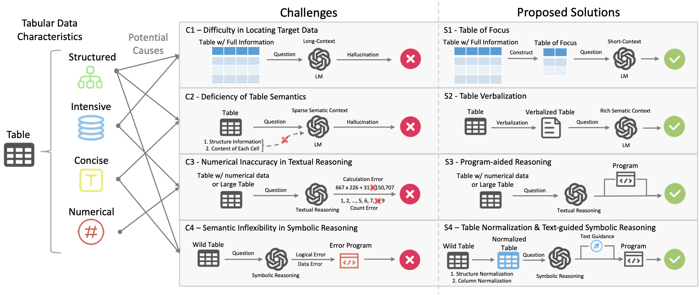

# TableMaster

Code and data repo of the paper "[TableMaster: A Recipe to Advance Table Understanding with Language Models]()".


## Introduction



Tables serve as a fundamental format for representing structured relational data. While current language models (LMs) excel at many text-based tasks, they still face challenges in table understanding due to the complex characteristics of tabular data, such as their structured nature. In this paper, we aim to enhance LMs for improved table understanding. We identify four key challenges: 1) difficulty in locating target data, 2) deficiency in table semantics, 3) numerical inaccuracies in textual reasoning, and 4) semantic inflexibility in symbolic reasoning. To address these issues, we propose TableMaster, a recipe and comprehensive framework that integrates multiple solutions to overcome these obstacles. TableMaster first extracts relevant table content and verbalizes it with enriched semantic context. Additionally, we introduce adaptive reasoning, a flexible approach that dynamically adjusts between textual and symbolic reasoning, tailoring the reasoning process to each query. Extensive analyses and experiments demonstrate our findings and the effectiveness of TableMaster. On the WikiTQ dataset, TableMaster achieves an accuracy of 78.13% using GPT-4o-mini, surpassing existing baselines.

## Project Structure


## Quick Start

```
python main.py
```


## Reference

```
@misc{cao2025tablemasterrecipeadvancetable,
      title={TableMaster: A Recipe to Advance Table Understanding with Language Models}, 
      author={Lang Cao},
      year={2025},
      eprint={2501.19378},
      archivePrefix={arXiv},
      primaryClass={cs.CL},
      url={https://arxiv.org/abs/2501.19378}, 
}
```
